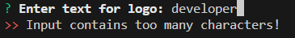
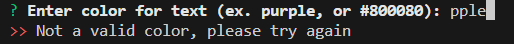

# SVG Logo Maker

## Description

This is a Node.js command-line application that generates a simple logo as a .svg file after receiving input from a few prompts.

- This project helped me develop my understanding of constructors and class inheritence.
- I was able to demonstrate my understanding of importing and exporting classes, functions, etc. between JavaScript modules.
- This was my first foray in creating test scripts using Jest to validate functionality of the application.
- To ensure correct user input syntax, I discovered and relied on the inquirer-maxlength-input-prompt and validate-color community packages which are credited later in this README file.

## Table of Contents

- [Installation](#installation)
- [Usage](#usage)
- [Credits](#credits)
- [License](#license)
- [Questions](#questions)

## Installation

This application requires Node.js and the following packages installed: inquirer, inquirer-maxlength-input-prompt, and validate-color.  With Node.js installed, clone the GitHub repository, then navigate to the project directory in a terminal and run the following code: npm install

## Usage

The code repository can be accessed here:
https://github.com/briandwach/svg-logo-maker

There is an example [logo.svg](./assets/examples/logo.svg) file in the ./assets/examples directory.  

This application is ran in a terminal with Node.js installed.  When in the root directory of the project, run the following code in the terminal: node index.js

  

The application will then present a series of prompts.

  

The prompt for text is limited to 3 characters.  None of the prompts are case sensitive and you will be alerted of any syntax errors before being able to proceed to the next prompt.  Colors can be input as keywords or as hexadecimal values preceeded with a #.

  

  

Once all the prompts are answered then a .svg logo file will be written in the ./generated directory. 

 

The generated logo has as resolution of 300x200 px and will adhere to the input provided. 

 

A video demonstration of the application can be viewed [HERE](https://drive.google.com/file/d/1-gb-YnJ2HFw5mBm3uA2RM436sfGWnUP_/view?usp=sharing)

- The video first demonstrates the application passing the created test scripts using the Jest framework.
- It then demonstrates the example syntax error responses when answering the prompts.
- Lastly, it shows the completion of the prompts and opening the generated svg logo file in a browser.

## Credits
This application utilizies the [inquirer-maxlength-input-prompt](https://www.npmjs.com/package/inquirer-maxlength-input-prompt) NPM package developed by [jwarby](https://github.com/jwarby).

This application utilizies the [validate-color](https://www.npmjs.com/package/validate-color) NPM package developed by [Wallace Sidhrée](https://github.com/dreamyguy).

## License
This application is covered under the [MIT License](http://choosealicense.com/licenses/mit/) 

## Questions
Please email me with any questions regarding this application at: 
brian.d.wach@gmail.com

Additionally, checkout more of my work on GitHub:
[briandwach](https://github.com/briandwach)