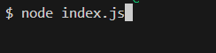
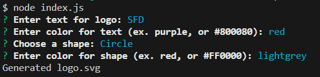
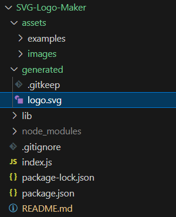

# SVG Logo Maker

## Description

This is a Node.js command-line application that generates a simple logo as a .svg file after receiving input from a few prompts.  

- This project helped me further develop my skills using API requests and asynchronous JavaScript. 
- I was able to demonstrate my understanding of arrow functions, template literals, and array destructuring.   
- The list of licenses is retrieved from GitHub's API and will stay up to date with common licenses.  
- Improving my focus on the DRY principle of coding was a large focus for this project.

## Table of Contents

- [Installation](#installation)
- [Usage](#usage)
- [Credits](#credits)
- [License](#license)
- [Questions](#questions)

## Installation

This application requires Node.js and the following packages installed: inquirer, inquirer-maxlength-input-prompt, and validate-color.  With Node.js installed, clone the GitHub repository, then navigate to the project directory in a terminal and run the following code: npm install

## Usage

The code repository can be accessed here:
https://github.com/briandwach/svg-logo-maker

There is an example logo.svg file in the ./assets/examples directory.  

This application is ran in a terminal with Node.js installed.  When in the root directory of the project, run the following code in the terminal: node index.js

  

The application will then present a series of questions.

  

Once they are all answered then a README file will be written in the ./generated directory. 

  

A video demonstration of the application can be found here:
https://drive.google.com/file/d/1-gb-YnJ2HFw5mBm3uA2RM436sfGWnUP_/view?usp=sharing

## Credits

## License
This application is covered under the following license: MIT License 

## Questions
Please email me with any questions regarding this application at: 
brian.d.wach@gmail.com

Additionally, checkout more of my work on GitHub:
[briandwach](https://github.com/briandwach)